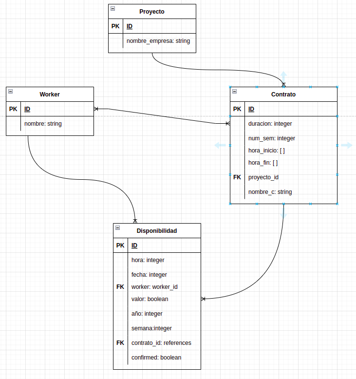

# 🧐 ProRecorrido - Proyecto test

## :scroll: Concepto

> Este repositorio contiene la API para el proyecto (test), el cual genera las diferentes rutas, metodos, controlladores, modelos necesarios para el funcionamiento adecuado de la aplicación.
> El proyecto consiste en crear una proyecto al cual se le puedan asignar trabajadores, y poder generar disponibilidad de trabajo para los dias de la semana, una vez todos los trabajadores coloquen los horarios en los que ellos estan disponibles para trabajar un algoritmo se encarga de distribuir las horas de trabajo entre los trabajadores asignados a este contrato, dando como resultado una confirmación del horario.

## :octocat: Uso

- Este proyecto tiene la intención de crear un API usando best Practics;
- Preparar la documentación de la arquitectura de datos;

## 🎥 PRESENTATION VIDEO
[Link Presentation Video](https://www.loom.com/share/3127c367fd374e3e8a210caf3bd9c1d8)

## 🛠 Built With

- Ruby on Rails
- Postgresql

## :bulb: Diagrama ERB



### :gem: Gems and tools

- Byebug: Depuración.
- Faker: Agregar datos falsos para tests.
- Factory bot Rails: creación de modelos (objetos) para testeo.
- Linters: Rubocop.
- Simple Cov: Verificar cuanto del código ha sido testeado.
- Rspec-rails: Testear todo el contenido de la aplicación rails.


## 🔧 Empezando

> Para obtener una copia local en funcionamiento, siga estos sencillos pasos de ejemplo.

- Ir a la página principal del repositorio.
- Presione el botón "Code" y obtenga el enlace del repositorio.
- Clónalo usando git clon.

### 📝 Pre-requisitos

- Ruby -v3.0.3
- Rails -v7.0.2
- Bundler -v2.3.6
### 📝 Configuración

 - Abre la terminal
 - Copía este código : 
        ```
        git clone "put the link from github repo"
        ```
 - Run the program with this code :
        ```
        bundle install
        yarn install --check-files
        ```       
- Run the program with this code :
        ```
        rails db:create db:migrate
        rails db:seed
        ```
- now you can run ```rails server```
- Stop the program with: "Ctrl + C" (Windows or Linux) or "Command + C"(Apple)

### 📝 ¿Como interactuar con la aplicación?

- Cuando la aplicación esta corriendo puedes ir a postman y revisar las diferentes rutas para ver en q forma estan siendo desplegados los datos

## 👤 Authors

👤 **Giordano Díaz**

- Github: [@diazgio](https://github.com/diazgio)
- Twitter: [@giordano_diaz](https://twitter.com/giordano_diaz)
- LinkenIn:[giordano-diaz](www.linkedin.com/in/Giordano-Diaz)

## 🤝 Contribuciones

¡Las contribuciones, los problemas y las solicitudes de funciones son bienvenidos!

Siéntase libre de comprobar el [issues page](issues/).

## :pray: Muestra tu apoyo

Dame una ⭐️ ¡si te gusto este proyecto!

## 📝 License

This project is [MIT](LICENSE) licensed.